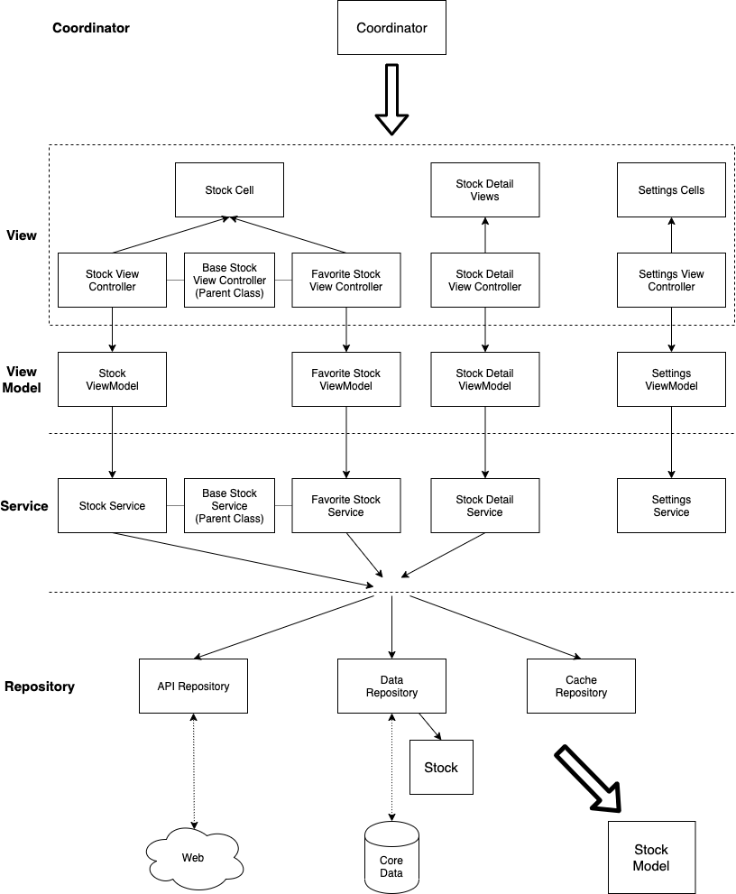

# ZipChallenge
(Last update: 10am, Friday 6th Of March, 2020)

Below is a diagram of the structure of the application. An MVVMC architecture is used in this app. I have chosen that architecture because it cleanly separates the navigation from the controllers and because I will not be constantly needing to update the navigation flow of the application.

A tab bar is used to change between the Stock, Favorites and Settings view controllers. Data is not passed between them but fetched from the repositories. The diagram shows the property relationships between each component, so the view controllers have view models as properties, the services have the repositories as properties (except for the Settings Service), etc. The coordinator instantiates the repositories and has them as properties and it injects them into each service. It also instantiates the view controllers, view models and services. The Stock Model struct is used throughout the app as the main data object and it conforms to the various displayable and persistable protocols so that the data is formatted for display and for persisting.

A clean architecture is used, along with MVVMC there is a service and repository layer. In terms of persisting data, the app only persists stocks once the profile for that stock has been fetched. Profile data is only fetched for stocks shown on the screen to the user. The idea is that users will only be interested in stocks that they scroll to, stocks that they scroll past will not be persisted or their profiles fetched. Every time a user scrolls the profile will be fetched and saved, due to the fact that the "percentage change" could update between fetches. Each time a new price is fetched in the favorites or detail screen the data is also persisted. In all cases data is saved to the cached data. The list of stocks is only saved in the cache data, as is the price history data. Persisting the whole list of stocks is too large a process and is a waste of space and resources.

The cache repository is used to fetch the stock model objects used throughout the app. The persistent data is loaded each time the app loads and should be used in the case that there is no internet connection. The exception to this is the historical price data that always needs an internet connection. I think that persisting the price history data of many stocks will use up unnecessary resources. The idea of persisting data is only so that a user gets access to the last persisted price (and also to show my knowledge of Core Data persistence). Essentially, most users will want the most up to date price data so therefore this application and all of its features should be used when online.

Some unit tests have also been added for the Cache and API Repositories to show my knowledge in unit testing.

This has been a great challenge and persisting the data offered different ways of thought and I had to make many assumptions but I think that I came to a user friendly conclusion.

I hope you enjoy reviewing my project!

### Important Notes for Testing
As most of you know, as of iOS 13.3.1, if using third party embedded CocoaPod frameworks you can no longer test on a device with a free Apple account, you need to add static libraries or use a paid account. I have chosen against this for the project so the best way to test this is using the simulator or a device with iOS 13.3.0 or less.

__Thank you!__
